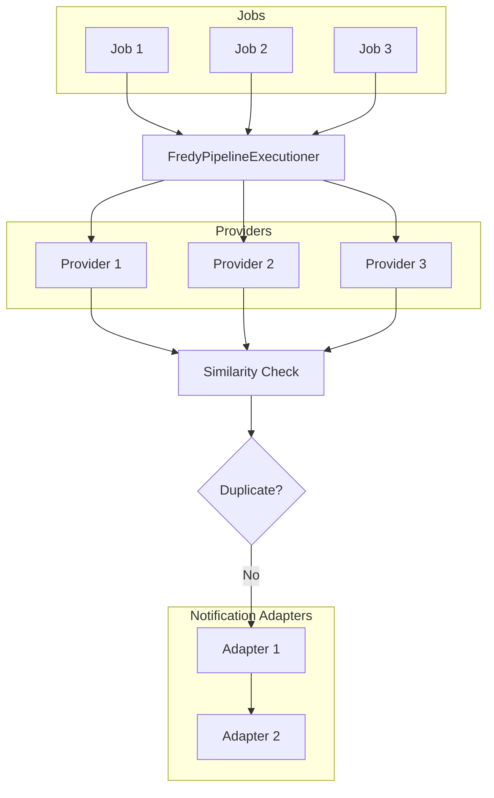

<p align="center">

<a href="https://fredy.orange-coding.net/">
<picture>
  <source media="(prefers-color-scheme: dark)" srcset="https://github.com/orangecoding/fredy/blob/master/doc/logo_white.png" width="400">
  <source media="(prefers-color-scheme: light)" srcset="https://github.com/orangecoding/fredy/blob/master/doc/logo.png" width="400">
  
</picture>
</a>
</p>

<p align="center">
  <a href="https://fredy.orange-coding.net/" target="_blank">Сайт</a>&nbsp;&nbsp;|&nbsp;&nbsp;
  <a href="https://fredy-demo.orange-coding.net/" target="_blank">Демо</a>
</p>

<p align="center">
  
  
  
  
</p>

# Fredy 🏡 – Ваш саморазмещаемый поисковик недвижимости в Германии

Искать жильё в Германии долго и сложно. **Fredy** автоматизирует поиск: парсит **ImmoScout24, Immowelt, Immonet, eBay Kleinanzeigen, WG-Gesucht** и сразу уведомляет через **Slack, Telegram, Email, ntfy, Discord и другие**.

Современная архитектура обеспечивает **удобный Web UI**, дедупликацию объявлений между платформами и хранение результатов, чтобы вы не видели одно и то же дважды.

------------------------------------------------------------------------

## ✨ Ключевые возможности

- 🏠 Парсинг **ImmoScout24, Immowelt, Immonet, eBay Kleinanzeigen, WG-Gesucht**
- ⚡ Мгновенные уведомления: Slack, Telegram, Email (SendGrid, Mailjet), ntfy, Discord и др.
- 🔎 Использование **мобильного API ImmoScout** (reverse engineering)
- 🌍 Запуск где угодно: Docker, Node.js, self-hosted
- 🖥️ Интуитивный Web UI для управления поисками
- 🎯 Простой интерфейс для настройки
- 🔄 Дедупликация между площадками
- ⏱️ Настраиваемые интервалы поиска

------------------------------------------------------------------------

## 🤝 Спонсорство [](https://github.com/sponsors/orangecoding)

Проект поддерживается в свободное время. Если он полезен — рассмотрите поддержку 💙

Fredy поддержан программой **JetBrains Open Source Support**.

------------------------------------------------------------------------

## 👨‍🏫 Демо

Попробуйте: [Fredy Demo](https://fredy-demo.orange-coding.net/)

------------------------------------------------------------------------

## 🚀 Быстрый старт

### Через Docker

> [!NOTE]
> Для запуска нужен `conf/config.json`. Можно взять готовый из репозитория: https://github.com/orangecoding/fredy/blob/master/conf/config.json

```bash
docker run -d --name fredy \
  -v fredy_conf:/conf \
  -v fredy_db:/db \
  -p 9998:9998 \
  ghcr.io/orangecoding/fredy:master
```

Логи:

```bash
docker logs fredy -f
```

### Ручной запуск (Node.js)

- Требование: **Node.js 22+**
- Установка и старт:

```bash
yarn
yarn run start:backend   # в одном терминале
yarn run start:frontend  # в другом терминале
```

👉 Откройте <http://localhost:9998>

### Unraid

Пользователи [Unraid](https://unraid.net/) могут установить Fredy из community store.

**Логин по умолчанию:**
- Username: `admin`
- Password: `admin`

------------------------------------------------------------------------

## 📸 Скриншоты

| Основной экран Fredy                        | Настройка задания                                   | Найденные объявления                         |
|---------------------------------------------|-----------------------------------------------------|----------------------------------------------|
|                |                   |              |

------------------------------------------------------------------------

## 🧩 Ключевые понятия

### Provider 🌐

**Provider** — площадка недвижимости (ImmoScout24, Immowelt, Immonet, eBay Kleinanzeigen, WG-Gesucht).
При создании задания вставьте поисковый URL из площадки. ⚠️ Убедитесь, что сортировка по **дате**, чтобы получать самые свежие объявления.

### Adapter 📡

**Adapter** — канал уведомлений (Slack, Telegram, Email, ntfy, Discord и др.). У каждого своя конфигурация (API-ключи, вебхуки). Можно включить несколько адаптеров одновременно — новые объявления пойдут во все каналы.

### Job 📅

**Job** объединяет провайдеры и адаптеры. Пример: «Искать квартиры на ImmoScout24 + Immowelt и слать в Slack + Telegram». Задания запускаются автоматически по интервалу в `conf/config.json`.

------------------------------------------------------------------------

## Immoscout

Из-за антибот-мер Immoscout используется обратный инжиниринг их мобильного API. Детали: [reverse-engineered-immoscout.md](https://github.com/orangecoding/fredy/blob/master/reverse-engineered-immoscout.md).

## Analytics

Fredy бесплатен и таким останется. По желанию можно включить анонимную отправку статистики раз в 6 часов: активные адаптеры/провайдеры, ОС, архитектура, версия Node, язык. Данные помогают понимать, что чаще используют.

## 🛠️ Разработка

### Dev-режим

```bash
yarn run start:backend:dev
yarn run start:frontend:dev
```
Откройте приложение в браузере; порт фронтенда выводится в терминал.

### Тесты

```bash
yarn run test
```

------------------------------------------------------------------------

## 📐 Архитектура



------------------------------------------------------------------------

## 👐 Участие

Спасибо всем контрибьюторам!

<a href="https://github.com/orangecoding/fredy/graphs/contributors"></a>

Руководство по вкладу: [CONTRIBUTING.md](https://github.com/orangecoding/fredy/blob/master/CONTRIBUTING.md).

------------------------------------------------------------------------

## ⭐ История звёзд

[](https://www.star-history.com/#orangecoding/fredy&Date)
